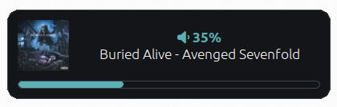

# Credits
This is a fork of https://gitlab.com/Nmoleo/i3-volume-brightness-indicator

The microphone control is based on https://gitlab.com/rituparnaw16/i3-volume-brightness-indicator/-/blob/main/volume_brightness.sh?ref_type=heads

# Windows-Style Media & Brightness Notifications using Dunst





This is a Bash script that uses Dunst to show an indicator on the screen when the volume, brightness, and song are changed. It ties into `playerctl` to fetch the current song title/artist/album. It can fetch the album art from a file or URL, and it will cache album art files in `/tmp` to reduce data usage and improve speeds. Album art has been tested with YouTube and Spotify on Arch Linux.

## Dependancies

* PulseAudio
* [light](https://archlinux.org/packages/extra/x86_64/light/)
* Font Awesome (`dnf install fontawesome-fonts fontawesome5-fonts` / `pacman -S ttf-font-awesome`)
* dunst (`dnf install dunst` / `pacman -S dunst`)

## Installation

1. Verify that all of the dependencies are installed
2. Edit `media-control` and set your desired values for the configuration options at the top
3. Copy `media-control` to a directory on your PATH
4. Edit `~/.config/dunst/dunstrc`
5. Under the `[global]` section, add `Font Awesome 5 Free Regular`
6. Change `origin` to `bottom-center` or your desired location

For i3 keybindings:
1. Edit `~/.config/i3/config`
2. Add the following lines:
    ```
    bindsym XF86AudioRaiseVolume exec --no-startup-id media-control volume_up
    bindsym XF86AudioLowerVolume exec --no-startup-id media-control volume_down
    bindsym XF86AudioMute exec --no-startup-id media-control volume_mute
    bindsym XF86MonBrightnessUp exec --no-startup-id media-control brightness_up
    bindsym XF86MonBrightnessDown exec --no-startup-id media-control brightness_down
    bindsym XF86AudioPlayPause exec --no-startup-id media-control play_pause
    bindsym XF86AudioPause exec --no-startup-id media-control play_pause
    bindsym XF86AudioPlay exec --no-startup-id media-control play_pause
    bindsym XF86AudioNext exec --no-startup-id media-control next_track
    bindsym XF86AudioPrev exec --no-startup-id media-control prev_track
    ```

## Configuration Reference

- `volume_step` - The amount by which the volume should be incremented/decremented each time the script is run
- `brightness_step` - The amount by which the brightness should be incremented/decremented each time the script is run
- `max_volume` - The maximum allowable volume. Typically 100.
- `notification_timeout` - The amount of time a notification should stay on the screen, in milliseconds
- `download_album_art` - Specifies if curl should be used to download album art if it's not a locally cached file
- `show_album_art` - Specifies if the album art should be displayed
- `show_music_in_volume_indicator` - Specifies if music information should be displayed along with the volume notification
