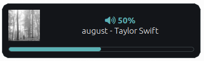

# Volume and Brightness Indicator for i3wm




This is a simple Bash script that uses Dunst to show an indicator on the screen when the volume, brightness, and song are changed.

## Dependancies

* PulseAudio
* [light](https://archlinux.org/packages/extra/x86_64/light/)
* Font Awesome (`dnf install fontawesome-fonts fontawesome5-fonts` / `pacman -S ttf-font-awesome`)
* dunst (`dnf install dunst` / `pacman -S dunst`)

## Installation

1. Verify that all of the dependancies are installed
2. Copy `volume_brightness.sh` to a folder on your computer
3. Edit `~/.config/dunst/dunstrc`
4. Under the `[global]` section, add `Font Awesome 5 Free Regular`
5. Change `origin` to `bottom-center` or your desired location
6. Edit `~/.config/i3/config`
7. Add the following lines:
	```
	bindsym XF86AudioRaiseVolume exec --no-startup-id /path/to/volume_brightness.sh volume_up
	bindsym XF86AudioLowerVolume exec --no-startup-id /path/to/volume_brightness.sh volume_down
	bindsym XF86AudioMute exec --no-startup-id /path/to/volume_brightness.sh volume_mute
    bindsym XF86MonBrightnessUp exec --no-startup-id /path/to/volume_brightness.sh brightness_up
    bindsym XF86MonBrightnessDown exec --no-startup-id /path/to/volume_brightness.sh brightness_down
    bindsym XF86AudioPlayPause exec --no-startup-id /path/to/volume_brightness.sh play_pause
    bindsym XF86AudioPause exec --no-startup-id /path/to/volume_brightness.sh play_pause
    bindsym XF86AudioPlay exec --no-startup-id /path/to/volume_brightness.sh play_pause
    bindsym XF86AudioNext exec --no-startup-id /path/to/volume_brightness.sh next_track
    bindsym XF86AudioPrev exec --no-startup-id /path/to/volume_brightness.sh prev_track
	```
8. Replace `/path/to/volume_brightness.sh` with the correct path to the script
9. Edit `volume_brightness.sh` and set your desired values for the configuration options at the top

## Configuration Reference

- `volume_step` - The amount by which the volume should be incremented/decremented each time the script is run
- `brightness_step` - The amount by which the brightness should be incremented/decremented each time the script is run
- `max_volume` - The maximum allowable volume. Typically 100.
- `notification_timeout` - The amount of time a notification should stay on the screen, in milliseconds
- `download_album_art` - Specifies if curl should be used to download album art if it's not a locally cached file
- `show_album_art` - Specifies if the album art should be displayed
- `show_music_in_volume_indicator` - Specifies if music information should be displayed along with the volume notification
